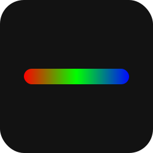

# Elgato Stream Deck – Logitech Litra Beam LX

A premium Stream Deck plugin for controlling Logitech Litra lights, specifically optimized for the **Litra Beam LX**.

*Based on the original work by [Michael Abon](https://github.com/michaelabon/streamdeck-logitech-litra).*



## Features & LX Optimizations
- **Full Litra Beam LX Support**: Optimized for the dual-light bar architecture.
- **Separate Front & Back Control**: Independently toggle, dim, and adjust temperature.
- **RGB Backlight Gradients**: Create smooth 2-color gradients across the 7 back-light zones.
- **Custom Presets**: Save your favorite colors and gradients into a library and cycle through them with a single button.
- **Premium UI**: Modern, high-contrast SVG icons tailored for Stream Deck OLED keys.
- **Auto Power Off**: Automatically turns off all lights when the Stream Deck application quits.

## Installation

Until this is listed on the Elgato Marketplace, you can build it manually:

1. **System Requirements**: 
   - [Go](https://go.dev/dl/) (check `go.mod` for version).
   - [just](https://github.com/casey/just) command runner.
2. **Build & Link**:
   - Clone this repository.
   - Run `just build link`.
3. **Restart**: Restart your Stream Deck application.
4. **Configure**: Drag the new "Logitech Litra" actions onto your keys and use the Property Inspector to set colors and presets.

## How to Create a New Release

To create an official release for GitHub:

1. **Tag the Commit**: Mark the state of the code with a version tag.
   ```powershell
   git tag -a v2.1.0 -m "Release version 2.1.0"
   ```
2. **Push Up**: Send the tags to GitHub.
   ```powershell
   git push origin main --tags
   ```
3. **Draft on GitHub**:
   - Go to your repository on GitHub.com.
   - Click on **Releases** > **Draft a new release**.
   - Select the tag you just pushed.
   - Add a title and description (you can copy from `CHANGELOG.md`).
   - Click **Publish release**.

## How do I contribute?

Pull requests are welcome! I have split the codebase into two parts:
1. `go/`: The Go backend for HID communication.
2. `ca.michaelabon.logitechlitra.sdPlugin/`: PI (UI) files and manifest.

## License

GNU General Public License v3.0, available at LICENSE
